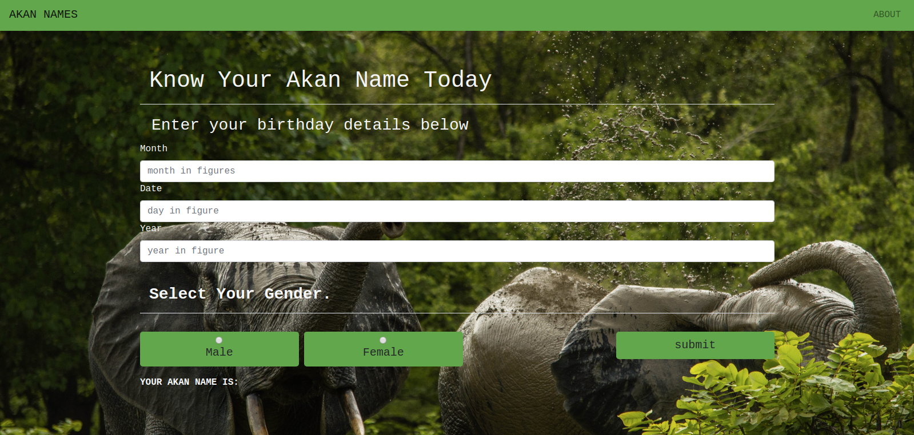

# Project Name:
>AKAN NAMES

# Project Author:
>Muthoni Stephen Ngugi

# Project Description:

>A website for generating Akan names based on your date of birth

# Technoligies used:
>The technoligies used were:
>>1. javascript
>>2. HTML
>>3. Bootstrap
>>4. some CSS

# Set Up Instructions
>The set up instructions for the project are:
>>1. git clone or download the zip file.
>>2. Extract the zip file.
>>3. cd into the project folder.
>>4. Launch the index.html file.

# User Stories:
## Landing Page
>

>>user gets to the page and sees the landing page where they fill in their date of birth and select their gender either male or female and then push the submit button and gets their Akan Name at the buttom of the screen

>

>>user checks navigates into the about page where they get a short explanation on what akan names are
# Project live link:
[Akan Names](https://ngugimuthoni.github.io/Akan_Name_generator/)
# Contact Info:

>EMAIL: ngugimuthoni43@gmail.com

>Phone-No: 0796******

# License and Copyright
>MIT License Copyright (c) 2020 (Muthoni Stephen Ngugi)

>Permission is hereby granted, free of charge, to any person obtaining a copy of this software and associated documentation files (the "Software"), to deal in the Software without restriction, including without limitation the rights to use, copy, modify, merge, publish, distribute, sublicense, and/or sell copies of the Software, and to permit persons to whom the Software is furnished to do so, subject to the following conditions:

>The above copyright notice and this permission notice shall be included in all copies or substantial portions of the Software.

>THE SOFTWARE IS PROVIDED "AS IS", WITHOUT WARRANTY OF ANY KIND, EXPRESS OR IMPLIED, INCLUDING BUT NOT LIMITED TO THE WARRANTIES OF MERCHANTABILITY, FITNESS FOR A PARTICULAR PURPOSE AND NONINFRINGEMENT. IN NO EVENT SHALL THE AUTHORS OR COPYRIGHT HOLDERS BE LIABLE FOR ANY CLAIM, DAMAGES OR OTHER LIABILITY, WHETHER IN AN ACTION OF CONTRACT, TORT OR OTHERWISE, ARISING FROM, OUT OF OR IN CONNECTION WITH THE SOFTWARE OR THE USE OR OTHER DEALINGS IN THE SOFTWARE.